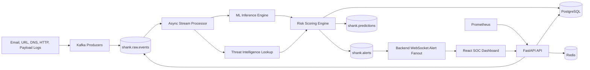

# SHANK Architecture

## Service Layout

## Layers

- Ingestion layer: API `/ingest`, Kafka producers, sample event producer, external feed downloaders.
- Processing layer: `app.workers.stream_processor`, async Kafka consumer, database persistence.
- ML inference layer: URL/email feature extraction, XGBoost classifier, Isolation Forest anomaly detector, deterministic fallback before model training.
- Storage layer: PostgreSQL forensic tables and indexed alert queries.
- API layer: FastAPI, JWT auth, RBAC, rate limiting, validation, CORS, secure headers.
- Dashboard layer: React, Tailwind, React Query, WebSocket live feed.
- Monitoring layer: Prometheus `/metrics`, Docker health checks.

## Kafka Topics

| Topic | Producer | Consumer | Purpose |
| --- | --- | --- | --- |
| `shank.raw.events` | API, sample producers, integrations | stream processor | Raw email, URL, DNS, HTTP, payload events |
| `shank.predictions` | stream processor | downstream SIEM/SOAR | Normalized prediction results |
| `shank.alerts` | stream processor | backend fanout, downstream alert integrations | High-risk alert events |

## Processing Flow

1. Security events arrive through `/api/v1/ingest` or a Kafka producer.
2. Stream processor consumes raw events asynchronously.
3. Feature extractor computes URL entropy, suspicious keywords, auth indicators, and attachment metadata.
4. Threat intelligence checks local feed matches and optional VirusTotal results.
5. ML engine calculates phishing probability and anomaly score.
6. Risk scorer emits `risk_score`, `severity`, and `confidence`.
7. Database stores event, prediction, alert, and forensic payload.
8. WebSocket fanout updates analyst dashboards in real time.
